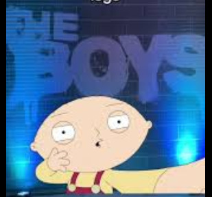
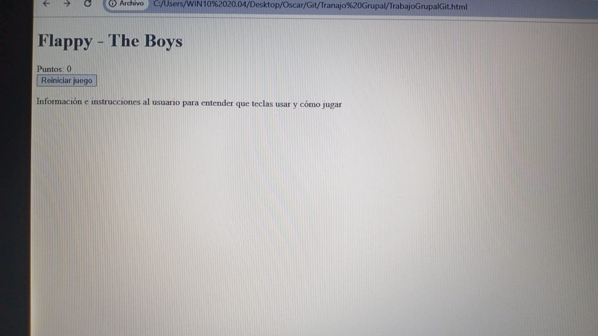
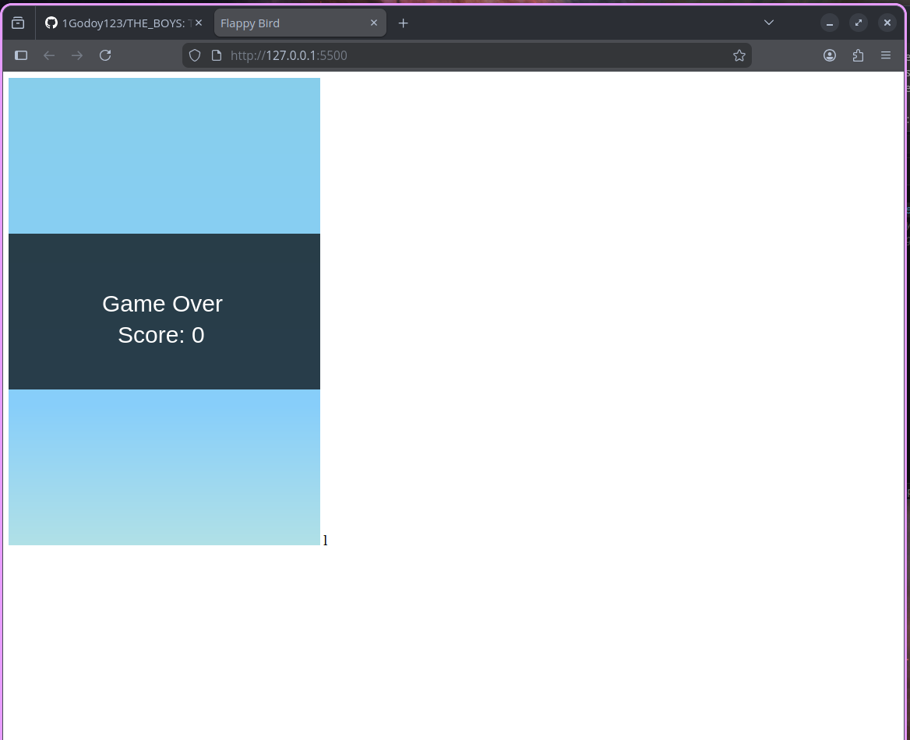
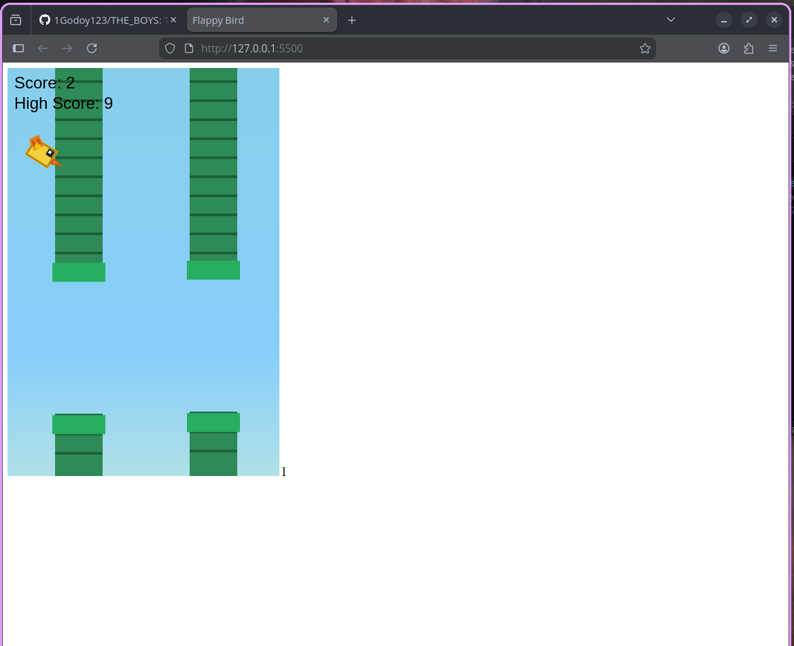
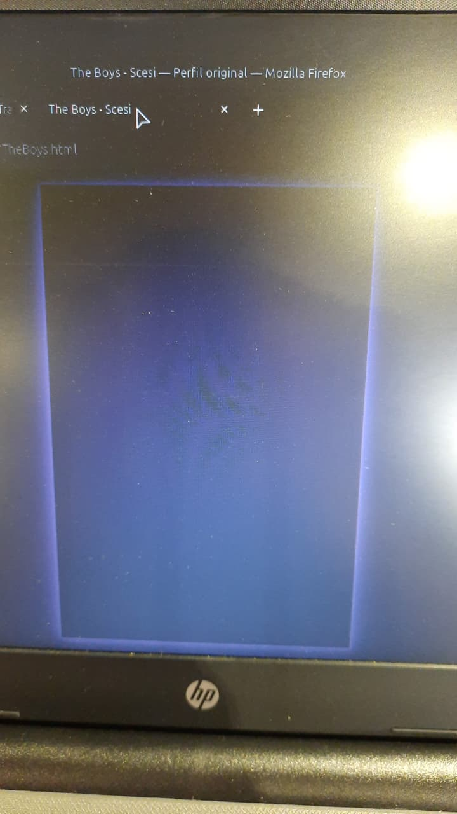
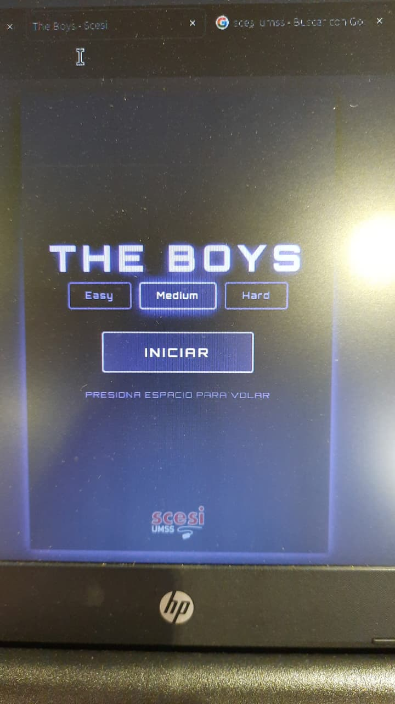

# THE_BOYS
Trabajo grupal para ingresar a la SCECI

The present README aims to detail and explain the process of developing the group work. As such, the project is divided into three fundamental parts: HTML, CSS, and JavaScript. How each part was made and what it is for will be defined below, from the HTML structure, the CSS design, and the JavaScript functionalities.

## HTML
HTML was used mainly in the creation of the structure and deployment of the web page. The content has been divided into three parts: Main header, score section, reset button, and game instructions.

### Main Header
For the main header, the "h1" tag was used. It consists of a simple text that is displayed at the beginning of the program.

### Score Section
The score shows the points that the user accumulates in a game. The "div, span" tags were used mainly to denote the section and for subsequent CSS design.

### Reset Button
The reset button has been implemented so that the user can play again or restart a game. The "button" tag was used and an id was added for design and programming.

### Game Instructions
It is a simple section, as it is a small paragraph that explains and gives small instructions. The "p, div" tags were used.

## JAVASCRIPT
Bird physics were added and how it will be used and its properties such as gravity.

### App Environment
For this part, where we are defining the environment constants, the state variables, and the logic of obstacle generation.

### Character Aesthetics
The aesthetics and animation that the character will have are being defined.

### Environment Aesthetics
In this block, where you define the visual rendering of the obstacles (pipes) with their details and textures.

### User Interface
This function is in charge of the user interface (UI).

### Game Cycle
The "gameLoop" function was implemented, which acts as the heart of the program. This is responsible for clearing the canvas and redrawing each element in each frame to create the illusion of fluid movement.

### Character Physics
In this section, it is detailed how the bird reacts to a simulated gravity. It was programmed to fall constantly unless the user interacts, achieving a realistic parabolic movement.

### Pipe Generation
A logic was defined so that the pipes appear infinitely and with variable heights. This ensures that each game is different and that the challenge is constant for the player.

### Score Storage
The use of the browser's memory was integrated to save the maximum score. In this way, the user can compete against their own record even if they close the page.

### Interaction and States
The use of the space key to control game actions is explained. In addition, the "playing" and "finished" states are managed to allow an instant restart after losing.

## CSS
The CSS handled the visual design and aesthetic experience of the game, covering everything from the base structure to animations and responsiveness.

### Global Styles
A general reset was applied with box-sizing, margin and padding set to zero to ensure consistency across browsers. The body uses flexbox to center the canvas on screen with a dark themed background.

### Typography
The Google Font "Orbitron" was integrated to give a futuristic and technological aesthetic in line with the game's theme.

### Canvas and Effects
The canvas was styled with purple borders and glow shadow effects using box-shadow, along with a pulse animation that makes the border glow continuously.

### Start Screen
An overlay was designed with the game title, difficulty buttons (Easy, Medium, Hard), a start button and instruction text for the player. It also supports both keyboard and touch input.

### Game Over Screen
The game over screen was styled with animations and glow effects that maintain visual consistency with the dark purple theme.

### SCESI Logo
The SCESI logo was added and is only visible on the start screen and game over screen, not during gameplay.

### Particle Animation
A star background animation was implemented using CSS keyframes to add depth and dynamism to the page.

### CSS Variables
All colors and fonts were organized using variables in :root to facilitate maintenance and visual consistency throughout the project.

### Responsive Design
Media queries were added to adapt the game to mobile screens under 480px, ensuring a good experience on any device.
